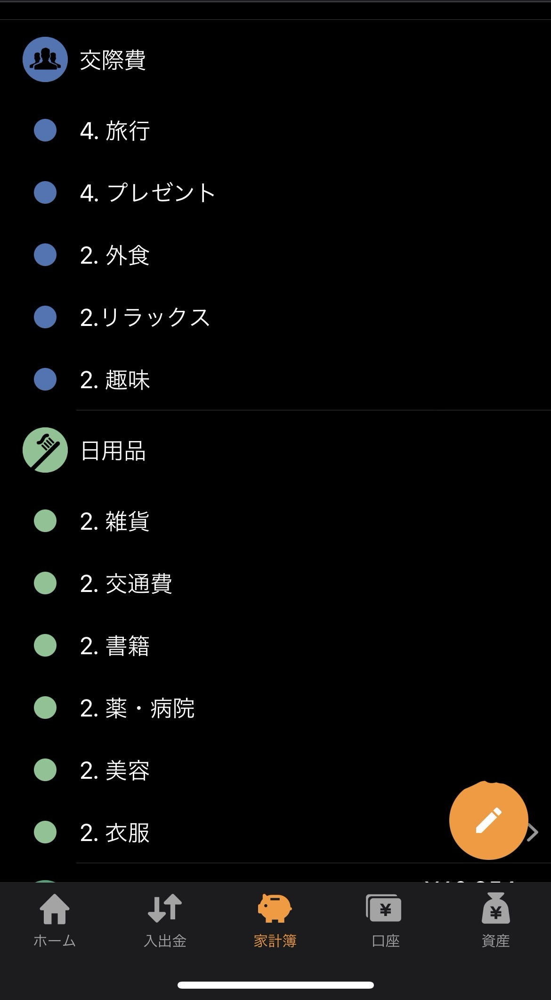

# 概要

学長が説明されている支出の 4 象限に基づいて、マネーフォワードのデータを集計し `Notion` へ記録するイベント駆動アプリケーションです。

# 構成図

(今後追加予定)

# 利用手順

> 支出データのサンプルを用意しました。  
> お試しとして利用してみてください。  
> [サンプルデータ](./sampleData/収入・支出詳細_2023-11-01_2023-11-30.csv)

## 1. マネーフォワードから支出データをダウンロード

1. **マネーフォワードにログイン**

2. **下記画像の「家計簿」ボタンをクリック**

3. **下記画像の「入出金」ボタンをクリック**

 

4. **集計対象の月へ移動**

5. **画面最下部までスクロール**

6. **下記画像の「ダウンロード」ボタンをクリック**

7. **下記画像の「CSV ファイル」ボタンをクリック**

   対象月の支出データが CSV ファイルとしてダウンロードされます。

 

## 2. ダウンロードした支出ファイルを S3 バケットにアップロード

1. **AWS コンソール画面にログイン**

2. **`Amazon S3` コンソール画面に移動**

3. **「moneyforwardmonthlyreportstack」から始めるバケットをクリック**

4. **下記画像の「アップロード」ボタンから、先ほどダウンロードした CSV ファイルをアップロード**

> **!! 注意 !!**  
> アップロードするファイルのファイル名に空白がある場合、処理がエラーになってしまいます。  
> お手数ですが、**ファイル名に空白が含まれていない**ことを確認してからアップロードしてください。  
> (この仕様は今後改善予定です)

## 3. 集計結果を `Notion` で確認

対象月の集計結果が下記画像のように出力されているはずです。  
データベースの列「手取り収入」欄に金額を入力すると、手取り収入に対する支出金額の割合が列「支出割合」に表示されます。

# 利用準備

## 1. `AWS アカウント`の取得

## 2. `IAM ユーザー`の作成

## 3. `Docker Desktop` のインストール

## 4. `AWS CDK` のインストール

## 5. `CDK` コマンドによる AWS リソースのデプロイ

## 6. Notion データベースの作成

下記 URL から Notion テンプレートを複製してご利用ください。  
テンプレートには、サンプルとして 1 行だけ支出情報が記録されています。  
適宜削除してご利用ください。

[マネーフォワード支出レポート](https://wholesale-dugong-42f.notion.site/8262afed5be4439d87b7b93f895574cf?v=ce7a1ea0c6a644079c88248cdf9bca10&pvs=4)

## 7. Notion データベースへのアクセス用 `Integretion` を作成

## 8. Notion データベースへ `Integretion` を追加

## 9. `AWS SSM` への環境変数等パラメータ設定

## 10. マネーフォワード内中項目の名称を変更

以下画像のように、項目名称の先頭に「1」「2」「3」「4」のいずれかを付与した中項目を新規作成してください。  
**大項目の中に番号が複数あっても問題ありません。**

# トラブルシューティング
