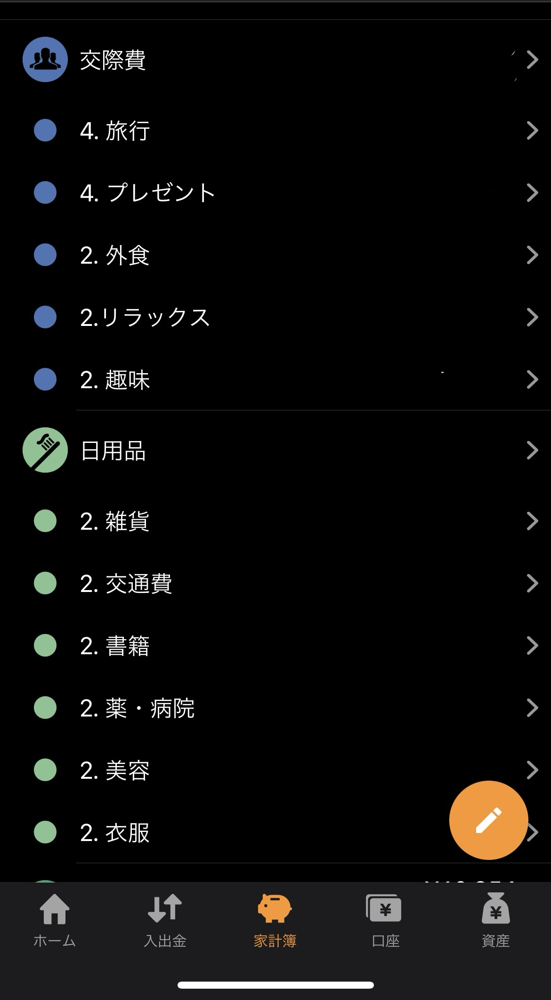

# 概要

学長が説明されている支出の 4 象限に基づいて、マネーフォワードのデータを集計し `Notion` へ記録するイベント駆動アプリケーションです。

# 構成図

(今後追加予定)

# 利用手順

> 支出データのサンプルを用意しました。  
> お試しとして利用してみてください。  
> [サンプルデータ](./sampleData/収入・支出詳細_2023-11-01_2023-11-30.csv)

## 1. マネーフォワードから支出データをダウンロード

1. **マネーフォワードにログイン**

2. **下記画像の「家計簿」ボタンをクリック**

3. **下記画像の「入出金」ボタンをクリック**

 

4. **集計対象の月へ移動**

5. **画面最下部までスクロール**

6. **下記画像の「ダウンロード」ボタンをクリック**

7. **下記画像の「CSV ファイル」ボタンをクリック**

   対象月の支出データが CSV ファイルとしてダウンロードされます。

 

## 2. ダウンロードした支出ファイルを S3 バケットにアップロード

1. **AWS コンソール画面にログイン**

2. **`Amazon S3` コンソール画面に移動**

3. **「moneyforwardmonthlyreportstack」から始めるバケットをクリック**

4. **下記画像の「アップロード」ボタンから、先ほどダウンロードした CSV ファイルをアップロード**

> **!! 注意 !!**  
> アップロードするファイルのファイル名に空白がある場合、処理がエラーになってしまいます。  
> お手数ですが、**ファイル名に空白が含まれていない**ことを確認してからアップロードしてください。  
> (この仕様は今後改善予定です)

## 3. 集計結果を `Notion` で確認

対象月の集計結果が下記画像のように出力されているはずです。  
データベースの列「手取り収入」欄に金額を入力すると、手取り収入に対する支出金額の割合が列「支出割合」に表示されます。

# 利用準備

## 1. `AWS アカウント`の取得

下記 URL を参考に、`AWS アカウント`を取得してください。

[AWS アカウントの作成](https://aws.amazon.com/jp/register-flow/)

## 2. `IAM ユーザー`の作成

下記 URL を参考に、`IAM ユーザー`を作成してください。  
今回作成する `IAM ユーザー`には、`AdministratorAccess` の権限を付与しています。

[IAM ユーザーの作成方法](https://www.cloudbuilders.jp/articles/518/)

## 3. `Docker Desktop` のインストール

## 4. `AWS CDK` のインストール

## 5. `CDK` コマンドによる AWS リソースのデプロイ

## 6. Notion データベースの作成

下記 URL から Notion テンプレートを複製してご利用ください。  
なお、テンプレートを複製するには Notion アカウントが必要です。

[マネーフォワード支出レポート](https://wholesale-dugong-42f.notion.site/8262afed5be4439d87b7b93f895574cf?v=ce7a1ea0c6a644079c88248cdf9bca10&pvs=4)

> テンプレートには、サンプルとして 1 行だけ支出情報が記録されています。  
> 適宜削除してご利用ください。

## 7. データベース ID の取得

以下 URL を参考に、Notion データベースの ID を取得してください。  
[【Notion】データベース ID を確認しよう](https://note.com/amatyrain/n/nb9ebe31dfab7)

## 8. Notion データベースへのアクセス用 `Integretion` を作成

下記 URL を参考に `Integretion` を作成してください。

[Notion API を使用したインテグレーションの作成](https://www.notion.so/ja-jp/help/create-integrations-with-the-notion-api)

## 9. Notion データベースへ `Integretion` を追加

下記 URL を参考に `Integretion` をデータベースに追加してください。

[API コネクトの追加・管理](https://www.notion.so/ja-jp/help/add-and-manage-connections-with-the-api)

## 10. `AWS SSM` への環境変数等パラメータ設定

> **！！ 注意 !!**  
> `AWS SSM` による環境変数の作成は、**東京リージョン**で実施してください。

`AWS SSM` における環境変数の設定方法は、以下公式ドキュメントの「パラメータを設定するには」を参照ください。  
[Systems Manager パラメータを作成する (コンソール)](https://docs.aws.amazon.com/ja_jp/systems-manager/latest/userguide/parameter-create-console.html)

設定する必要のある内容は下記表の通りです。  
**表内のパラメータ名をそのまま `AWS SSM` に設定してください。**

| パラメータ名                             | タイプ       | 値                                                                                  | 説明                                                   |
| ---------------------------------------- | ------------ | ----------------------------------------------------------------------------------- | ------------------------------------------------------ |
| `moneyforwardMonthlyReport-notionDBId`   | SecureString | Notion データベースの ID                                                            | 「7. データベース ID の取得」で取得したデータベース ID |
| `moneyforwardMonthlyReport-notionAuth`   | SecureString | 「8. Notion データベースへのアクセス用 `Integretion` を作成」で取得したシークレット | `Notion Integration` の認証用シークレット              |
| `moneyforwardMonthlyReport-categoryList` | StringList   | `1. 定期・固定費,2. 定期・変動費,3. 不定期・固定費,4. 不定期・変動費`               | Notion データベース内の列名をカンマ区切りで設定        |

## 11. マネーフォワード内中項目の名称を変更

下記 URL を参考に、マネーフォワード内の中項目の名称を編集します。

[カテゴリを追加、編集、削除する方法](https://support.me.moneyforward.com/hc/ja/articles/4406222214937-%E3%82%AB%E3%83%86%E3%82%B4%E3%83%AA%E3%82%92%E8%BF%BD%E5%8A%A0-%E7%B7%A8%E9%9B%86-%E5%89%8A%E9%99%A4%E3%81%99%E3%82%8B%E6%96%B9%E6%B3%95)

以下画像のように、項目名称の先頭に「1」「2」「3」「4」のいずれかを付与した中項目を新規作成してください。  
**大項目の中に番号が複数あっても問題ありません。**

> **！！ 注意 !!**  
> 先頭に付与する数字は**半角**でお願いします。

# トラブルシューティング
